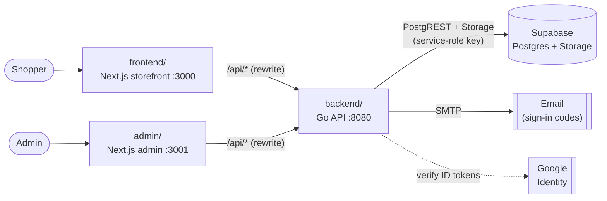

# TechXStudio

An Apple-inspired online store built as a learning project: a Next.js storefront, a separate
Next.js admin panel and a Go REST API, with Supabase (Postgres + Storage) underneath.

> TechXStudio is a personal demo project for learning purposes. It is not affiliated with,
> endorsed by, or sponsored by Apple Inc. Product names are trademarks of their respective owners.
> Checkout records orders but takes no real payment.

## Features

**Storefront** (`frontend/`, port 3000)
- Home page with category grid, a flash-sale shelf with countdown, and "popular" and accessories shelves
- Category pages with filtering and sorting, instant search, product quick view and a side-by-side compare panel
- Product pages with colors, storage options, specs, recommendations and customer reviews (write, edit, delete; ratings recalculate automatically)
- Wishlist, cart, coupon codes, checkout, and order history with a status timeline (confirmed orders can be cancelled)
- Accounts: sign-up and password login confirmed with a 6-digit code sent by email, *Sign in with Google*, profile photo,
  a unique username with change history, and account deletion
- Thai / English, light / dark mode, and a mobile layout with a bottom navigation bar

**Admin panel** (`admin/`, port 3001)
- Products: create, edit and delete, including colors, options and specs; show or hide products in the store; pick home-page shelves
- Coupons: create, edit, switch on/off, delete; percent or fixed-amount discounts with a minimum spend, cap, usage limit and expiry
- Orders: every customer's orders, with search, status filters and status updates
- Only accounts with `role = 'admin'` can sign in (password + emailed code, or Google)

**API** (`backend/`, port 8080)
- Go standard library HTTP server (no framework) talking to Supabase through PostgREST and the Storage API
- JWT sessions, bcrypt passwords, admin role checked from the database on every admin request
- Two-step sign-in with HMAC-hashed one-time codes, Google ID-token verification, and SMTP email

## Architecture



Both web apps only call their own `/api/*` path; Next.js rewrites forward it to the Go API. Only the API holds the
Supabase service-role key, so the browser never talks to the database directly.

## Tech stack

| Part | Built with |
|---|---|
| Storefront | Next.js 16 (App Router), React 19, TypeScript, Tailwind CSS 4, Zustand, Framer Motion, next-themes, Sonner, Lucide |
| Admin | Next.js 16, React 19, TypeScript, Tailwind CSS 4 (same design tokens as the storefront) |
| API | Go 1.26, `net/http`, `golang-jwt/jwt`, `golang.org/x/crypto/bcrypt` |
| Data | Supabase: Postgres with row-level security, Storage (profile photos), SQL migrations via the Supabase CLI |

## Project structure

```
.
├── frontend/                 Storefront (Next.js)
│   └── src/
│       ├── app/              Pages: /, /category/[slug], /product/[id], /cart, /wishlist, /orders, /account
│       ├── components/       UI by area (home, product, cart, orders, account, auth, layout, ui)
│       ├── context/          Auth and language providers
│       ├── stores/           Cart, wishlist and compare state (Zustand)
│       └── lib/i18n/         Thai and English strings
├── admin/                    Admin panel (Next.js): /login, /products, /products/new, /products/[id], /orders, /coupons
└── backend/
    ├── cmd/server/           API entry point
    ├── internal/
    │   ├── api/              HTTP handlers and routes (server.go lists every route)
    │   ├── auth/             JWTs, one-time codes, Google ID-token verification
    │   ├── mail/             SMTP sender
    │   ├── models/           Shapes of database rows
    │   ├── supabase/         Small PostgREST + Storage client
    │   └── config/           Settings from the environment / .env
    └── supabase/
        ├── config.toml       Supabase CLI settings
        └── migrations/       001–006, applied in order
```

## Getting started

### Prerequisites

- [Go](https://go.dev/dl/) 1.26 or newer
- [Node.js](https://nodejs.org/) 20.9 or newer
- A [Supabase](https://supabase.com/) project and the Supabase CLI (`brew install supabase/tap/supabase`)
- Optional: a Gmail App Password (to email sign-in codes) and a Google OAuth client (for *Sign in with Google*)

### 1. Create the database

```bash
cd backend
supabase login
supabase link --project-ref <your-project-ref>   # asks for the database password
supabase db push                                  # applies migrations 001–006
```

This creates the tables, row-level security policies, the `avatars` storage bucket, and seed data (7 products, 3 coupons).

### 2. Run the API

```bash
cd backend
cp .env.example .env    # fill in SUPABASE_URL, SUPABASE_SERVICE_ROLE_KEY and JWT_SECRET (see below)
go run ./cmd/server     # http://localhost:8080
```

`curl localhost:8080/healthz` should answer `{"ok":true,"supabase":true}`.

### 3. Run the storefront

```bash
cd frontend
npm install
npm run dev             # http://localhost:3000
```

### 4. Run the admin panel

```bash
cd admin
cp .env.example .env.local
npm install
npm run dev             # http://localhost:3001
```

### 5. Make yourself an admin

Sign up in the storefront, then run this in the Supabase SQL Editor:

```sql
UPDATE users SET role = 'admin' WHERE email = 'you@example.com';
```

## Configuration

### `backend/.env`

| Variable | Required | Description |
|---|---|---|
| `PORT` | | API port (default `8080`) |
| `APP_URL` | | Storefront origin allowed by CORS (default `http://localhost:3000`) |
| `SUPABASE_URL` | ✓ | `https://<project-ref>.supabase.co` |
| `SUPABASE_SERVICE_ROLE_KEY` | ✓ | The **legacy** `service_role` key (starts with `eyJ`) from *Project Settings → API Keys*. It bypasses row-level security, so keep it server-side only |
| `JWT_SECRET` | ✓ | Random secret for signing sessions and hashing codes, e.g. `openssl rand -hex 32` |
| `GOOGLE_CLIENT_ID` | | OAuth client ID (type *Web application*). Empty = Google sign-in hidden |
| `SMTP_HOST`, `SMTP_PORT`, `SMTP_USERNAME`, `SMTP_PASSWORD`, `SMTP_FROM` | | Mail server for sign-in codes (Gmail: `smtp.gmail.com`, `587`, your address, an App Password, `TechXStudio <you@gmail.com>`). Empty `SMTP_HOST` = codes are printed in the API log instead (development only) |

For Google sign-in, add `http://localhost:3000` and `http://localhost:3001` to the OAuth client's *Authorized JavaScript origins*.

### `frontend` and `admin`

| Variable | App | Default | Description |
|---|---|---|---|
| `API_URL` | both | `http://localhost:8080` | Where `/api/*` is proxied |
| `NEXT_PUBLIC_STORE_URL` | admin | `http://localhost:3000` | Storefront URL for "View in store" links and image previews |

`.env`, `.env.local` and other secrets are git-ignored. Never commit them.

## Database migrations

| File | What it adds |
|---|---|
| `001_initial_schema.sql` | Users, products (colors, options, specs), reviews, cart, wishlist, coupons, orders |
| `002_seed_data.sql` | Sample products and coupons (`TECHX10`, `FIRST20`, `FLASH500`) |
| `003_rls_policies.sql` | Row-level security on every table |
| `004_admin.sql` | `users.role` and `admin_save_product()`, which saves a product with its colors, options and specs in one transaction |
| `005_google_and_email_codes.sql` | Google accounts (`google_sub`, optional password) and `login_challenges` for emailed codes |
| `006_usernames_and_avatars.sql` | Case-insensitive unique usernames, `username_history` (filled by a trigger on every rename), and the `avatars` storage bucket |

Add new changes as the next numbered file and run `supabase db push`. Don't edit a migration that has already been applied.

## How sign-in works

1. **Password → emailed code.** A correct password doesn't sign you in yet: the API emails a 6-digit code and returns a
   `challenge_id`. `POST /api/auth/login/verify` exchanges the code for a session token. Sign-up works the same way, which
   also proves the email address is real.
   - Codes expire after 10 minutes and allow 5 wrong guesses.
   - A new code can be requested every 60 seconds, 5 times at most.
   - At most 5 password sign-ins per account every 15 minutes.
   - Only an HMAC of each code is stored.
2. **Google.** The browser gets an ID token from Google's button. The API checks its signature against Google's keys, the
   audience (our client ID), the issuer and the expiry. Google accounts skip the emailed code. In the store they are
   created or linked by email; the admin panel only accepts existing admins.
3. **Admin.** Same flows under `/api/admin/login*`, plus a role check. Every admin request re-reads `users.role`, so
   removing the role takes effect immediately.

## API overview

All responses are JSON; errors are `{ "error": "message" }`. Routes marked 🔒 need `Authorization: Bearer <token>`,
and admin routes need an admin's token.

<details>
<summary>All routes (see <code>backend/internal/api/server.go</code>)</summary>

| Area | Routes |
|---|---|
| Health | `GET /healthz` |
| Sign-in | `POST /api/auth/signup` · `POST /api/auth/login` · `POST /api/auth/login/verify` · `POST /api/auth/login/resend` · `POST /api/auth/google` · `GET /api/auth/providers` |
| Account 🔒 | `GET` / `PUT` / `DELETE /api/auth/me` · `PUT` / `DELETE /api/auth/me/avatar` · `GET /api/auth/me/username-history` · `GET /api/auth/username-available?username=` |
| Products | `GET /api/products?category=` · `GET /api/products/search?q=` · `GET /api/products/{id}` · `GET /api/products/curated/{flash_sale\|popular\|accessories}` |
| Reviews | `GET /api/products/{id}/reviews` · 🔒 `POST` / `PUT` / `DELETE /api/products/{id}/reviews` |
| Cart 🔒 | `GET` / `POST /api/cart` · `PATCH` / `DELETE /api/cart/{id}` |
| Wishlist 🔒 | `GET` / `POST` / `DELETE /api/wishlist` |
| Coupons | `POST /api/coupons/validate` |
| Orders 🔒 | `GET` / `POST /api/orders` · `PATCH /api/orders/{id}` (cancel) |
| Admin sign-in | `POST /api/admin/login` · `POST /api/admin/login/verify` · `POST /api/admin/login/google` · 🔒 `GET /api/admin/me` |
| Admin products 🔒 | `GET` / `POST /api/admin/products` · `GET` / `PUT` / `PATCH` / `DELETE /api/admin/products/{id}` |
| Admin coupons 🔒 | `GET` / `POST /api/admin/coupons` · `PUT` / `DELETE /api/admin/coupons/{id}` |
| Admin orders 🔒 | `GET /api/admin/orders` · `PATCH /api/admin/orders/{id}` (status) |

</details>

## Testing

```bash
cd backend && go vet ./... && go test ./...     # API, auth (JWT, codes, Google tokens) and mail tests
cd frontend && npm run typecheck
cd admin && npm run typecheck
```

The Go tests run against a fake Supabase server, so they need no network or credentials.

## Notes and limitations

- **No payments.** Checkout creates an order but doesn't charge anything. A payment gateway would be needed for a real shop.
- **Free-tier limits.** A free Supabase project pauses after about a week without traffic. Gmail sends about 500 emails a day.
  For real traffic, use a transactional email service; only the `SMTP_*` settings change.
- **Product images.** `image_url` paths such as `/images/x.png` are served from `frontend/public/`. Products without an
  image show a drawn device illustration in the product's color.
- **Removed profile photos.** Photos are cached for up to an hour, so a removed photo can stay reachable at its old URL
  for up to an hour.
- **Deployment.** The project runs locally. Hosting (for example on Vercel) is not set up yet.
